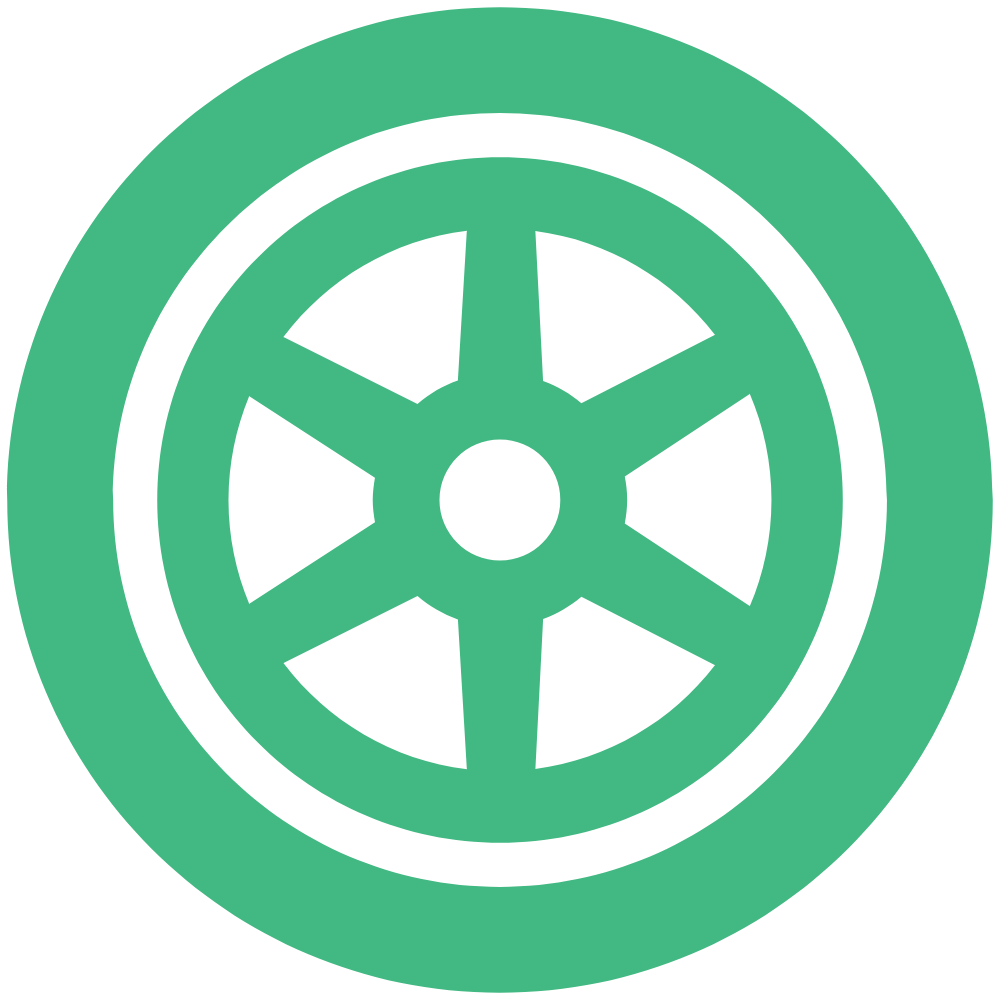

# Wheel UI

</img> (Wheel) UI is a great UI library based on Vue.js. 
It provides some useful components. Very suitable for mobile and PC.

## Features
1. An enterprise-class UI design system for web applications.
2. A set of high-quality Vue components out of the box.
3. Written in ES6 with predictable static types.
4. The whole package of development and design resources and tools.

## Get Started

1. Add CSS styles

    Before you use this UI, please enable border-box
    
    ```css
    * { box-sizing: border-box; }
    *::before { box-sizing: border-box; }
    *::after { box-sizing: border-box; }
    ```
    
    This feature supports IE8+ browsers.
    
2. Install wheel-ui
    
    ```
    npm i --save wheel-ui
    ```

3. Import wheel-ui
    ```javascript
    import {Button} from 'wheel-ui';
    import 'wheel-ui/dist/index.css'
    
    export default {
      name: 'app',
      components: {
        'w-button': Button
      }
    }
    ``` 
## Documentation

The documentation is developed with [vuepress](https://vuepress.vuejs.org/). 
All usages of components are included in this docs.
Please check [this](https://haixiang6123.github.io/wheel-ui/) out.

## Contribution

Your any contributions will help me to improve this UI library.
I welcome all developers to join me.